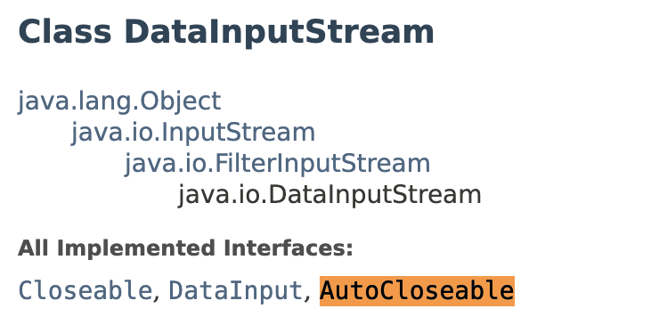

# try-with resource
- try 구문에 리소스를 사용하고 리소스를 자동으로 반납(close)해주는 기능을 제공한다.
- JDK1.7부터 try-catch 변형으로 새로 추가되었다.
- 주로 입출력(I/O)와 관련된 클래스 중에 사용한 후 꼭 닫아 줘야하는 것들(close())을 사용할 때 유용하다.

```java
try {
    FileInputStream fis = new FileInputStream("score.dat");
    DataInputStream dis = new DataInputStream(fis); //DataInputStream을 사용해서 데이터를 읽어오는 코드
} catch (IOException ie){
    ie.printStarTrace();
} finally {
    // dis.close();     // 데이트를 읽는 와중에 예외가 발생하더라도 닫히도록 finally 블록에 작성

    try {
        if(dis != null){
            dis.close();   // close()에서 발생할 수 있는 예외 처리 해아함
        } catch(IOException ie){
            ie.printStarTrace();    // finally에서 예외가 발생하면 try 블럭의 예외는 무시됨.
        }
    }
}
```

## 구문
```java
try (FileInputStream fis = new FileInputStream("score.dat");
    DataInputStream dis = new DataInputStream(fis)){

    while(true){
        score = dis.readInt();
        System.out.pirntln(Score);
        sum += score;
    }    
} catch (IOException ie){
    ie.printStarTrace();
} 
```
- try-with-resource문의 괄호()안에 객체를 생산하는 문장을 넣으면, 이 객체는 따로 close()를 호출하지 않아도 try블럭을 벗어나는 순간 자동적으로 close()가 호출된다.
- 그 다음에 catch블럭 또는 finally블럭이 수행된다.
- 자동으로 객체의 close()가 호출되러면 클래스가 **AutoCloseable** 이라는 인터페이스를 구현한 것이어만 한다.   



---
### 참고
- https://hianna.tistory.com/546
- 자바의 정석