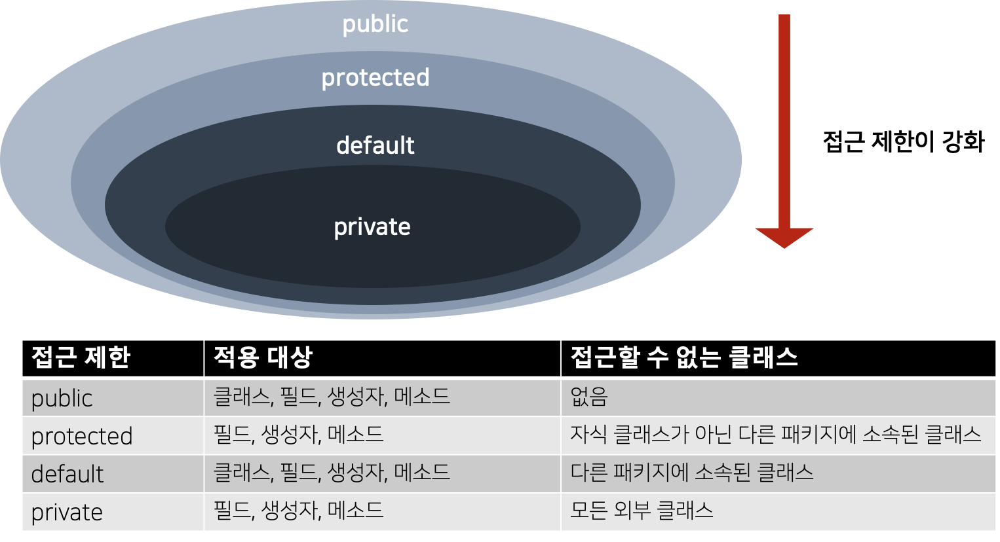
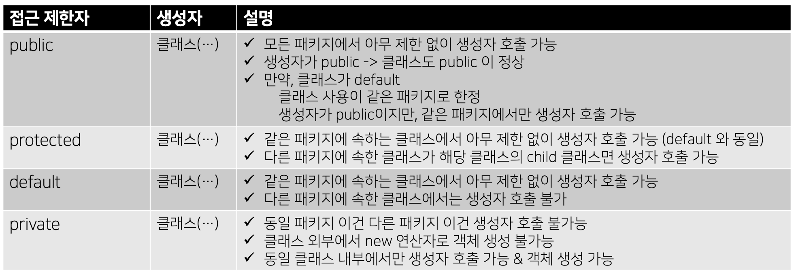
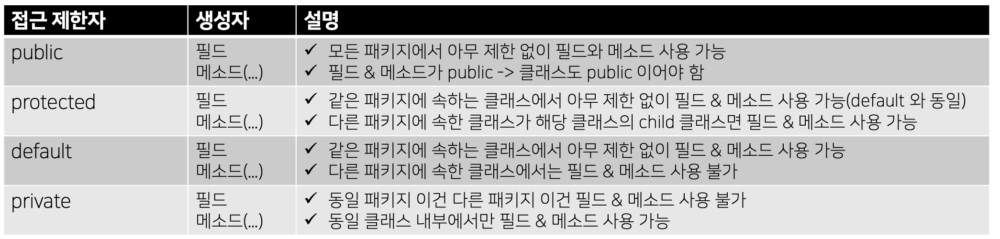

# 접근 지시자 (Access Modifier)

- 라이브러리 클래스 (main() 메소드를 가지지 않는 클래스)는 외부 클래스에서 접근할 수 있는 멤버와 접근 할 수 없는 멤버로 구분해서 필드, 생성자, 메소드를 설계하는 것이 바람직함
- 객체 생성을 막기 위해 생성자를 호출하지 못하게 하거나, 객체의 특정 데이터를 보호하기 위해 해당 필드에 접근하지 못하도록 막아야 함
- 특정 메소드를 호출할 수 없도록 제한해야 함

### → 접근 지시자 를 통해 구현 가능하다

## 1. 접근 지시자



[출처] : 이것이 자바다 - 신용권의 Java 프로그래밍 정복 1권 p.257

- public
  - 외부 클래스가 자유롭게 사용할 수 있는 공개 멤버
- protected
  - 같은 패키지 또는 자식 클래스에서만 사용할 수 있는 멤버
- private
  - 외부에 노출되지 않는 멤버
- default
  - 위 세 가지 접근 제한자가 적용되지 않은 멤버
  - 같은 패키지에 소속된 클래스에서만 사용할 수 있는 멤버

## 2. 클래스의 접근 제한 (public / default)

#### 클래스에 이용하는 접근 지시자의 쟁점

- 같은 패키지 내에서만 사용할 것인지 vs 다른 패키지에서도 사용할 수 있도록 할 것 인지에 대한 지시

### 1. default 접근 제한

→ 같은 패키지에서는 제한 없이 사용 가능, 다른 패키지에서는 사용 불가

```java
class 클래스 { ... }
```

### 2. public 접근 제한

→ 같은 패키지뿐만 아니라 다른 패키지에서도 제한 없이 사용 가능 (필드로 선언 가능)

```java
public class 클래스 { ... }
```

#### 클래스의 접근 제한 예제

- default 접근 제한을 가지는 클래스 A

```java
package ch6.class_example.package1;

class A {} // default 접근 제한
```

- public 접근 제한을 가지는 클래스 B

```java
package ch6.class_example.package1;

public class B {
		A a; // 같은 패키지이므로 B에서 A 사용 가능, 접근 가능 (필드로 선언 가능)
}
```

- B 클래스는  A 클래스와 같은 패키지 내에 있으므로 A 클래스에 접근이 가능하다
  - B 클래스에서 A 클래스를 이용하여 필드 선언 , 생성자 / 메소드 내부에서 변수 선언 가능하다


- 클래스 A와 클래스 B와는 다른 패키지에 있는 클래스 C

```java
package ch6.class_example.package2;

import ch6.class_example.package1.*;

public class C {
	A a; // 불가능
	B b;
}
```

##### 컴파일 에러가 발생

- C 클래스는 A 클래스와 다른 패키지이므로, default 접근 제한에 해당하는 A 클래스에는 접근이 되지 않는다
- B 클래스는 public 으로 공개되어있으므로 접근 가능하다
  - 그래서, C 클래스에서 B 클래스를 이용하여 필드 선언 및 생성자 / 메소드 내부에서 변수 선언이 가능하다

## 3. 생성자의 접근 제한 (public / protected / default / private)

#### 생성자에 이용하는 접근 지시자의 쟁점

- 생성자가 어떤 제한 접근자를 가지냐에따라 생성자 호출 가능 여부를 결정한다 (new  연산자로 생성자 호출 가능 여부 결정)

```java
public class ClassName {
		// public 접근 제한
		public ClassName( ... ) { ... }

		// protected 접근 제한
		protected ClassName( ... ) { ... }

		// default 접근 제한
		default ClassName( ... ) { ... }

		// private 접근 제한
		private ClassName( ... ) { ... }
}
```

- 클래스에 생성자 선언을 하지 않으면, 컴파일러에 의해 자동적으로 기본 생성자를 추가한다.
- 그러면, 자동으로 생성되는 기본 생성자의 접근 제한은 무엇인가?
  - **클래스의 접근 제한과 동일하다**
    - default  클래스 → default 기본 생성자
    - public 클래스 → public 기본 생성자



[출처] : 이것이 자바다 - 신용권의 Java 프로그래밍 정복 1권 p.260

#### 생성자의 접근 제한 예제

- 클래스 A의 public, default, private 생성자

```java
package ch6.example.package3;

public class A {
		// 생성자
		public A (boolean b) {} // public
		A (int b) {}            // default
		private A (String s) {} // private

		// 필드
		A a1 = new A(true);
		A a2 = new A(3);
		A a3 = new A("문자열");
}
```

##### 같은 클래스 내 모두 호출 가능

------

- 클래스 B에서 클래스 A의 생성자에 접근하고자 함

```java
package ch6.example.package3;

public class B {
		// 필드
		A a1 = new A(true);
		A a2 = new A(3);
		A a3 = new A("문자열"); // **생성자 호출 불가능**
}
```

##### 같은 패키지 내 다른 클래스이므로, **private 생성자 호출 불가능 (컴파일 에러)**

------

- 클래스 C에서 클래스 A의 생성자에 접근하고자 함

```java
package ch6.example.package4;

import ch6.example.package3.*;

public class C {
		// 필드
		A a1 = new A(true);
		A a2 = new A(3); **// 생성자 호출 불가능**
		A a3 = new A("문자열"); **// 생성자 호출 불가능**
}
```

##### 다른 패키지 → **default 생성자 & private 생성자 접근 불가 (컴파일 에러)**

## 4. 필드와 메소드의 접근 제한 (public / protected / default / private)

#### 필드와 메소드에 사용하는 접근 지시자의 쟁점

- 클래스 내부에서만 사용할 것인지 vs 패키지 내부에서만 사용할 것인지 vs 다른 패키지에서도 사용 가능할 것인지를 결정

```java
// 필드 선언
[ public | protected | private ] [static] 타입 필드;

// 메소드 선언
[ public | protected | private ] [static] 리턴타입 메소드( ... ) { ... }
```



[출처] : 이것이 자바다 - 신용권의 Java 프로그래밍 정복 1권 p.263

#### 필드 & 메소드의 접근 제한 예제

- 클래스 A의 public, default, private 필드와 메소드

```java
package ch6.example.package5;

public class A {
		// 필드
		public int field;
		int field2;
		private int field3;

		// 메소드
		public void method1() {}
		void method2() {}
		private void method3() {}

		// 생성자
		public A() {
				field1 = 1;
				field2 = 1;
				field3 = 1;

		}
}
```

##### 클래스 내부이므로,  모든 필드와 메소드 사용 가능

------

- 클래스 A와 같은 패키지 내에 있는 클래스 B에서의 필드 및 메소드 접근

```java
package ch6.example.package5;

public class B {
		public B() {
				A a = new A();
				a.field1 = 1;
				a.field2 = 1;
				a.field3 = 1;  **// 접근 불가**

				a.method1();
				a.method2();
				a.method3();  **// 접근 불가**
		}
}
```

##### 같은 패키지 내 다른 클래스이므로,  **private 접근 불가 (컴파일 에러)**

------

- 클래스 A와 다른 패키지 내에 있는 클래스 C에서의 필드 및 메소드 접근

```java
package ch6.example.package6;

import ch6.example.package5.*;

public class C {
		public C() {
				A a = new A();
				a.field1 = 1;
				a.field2 = 1;  **// 접근 불가**
				a.field3 = 1;  **// 접근 불가**

				a.method1();
				a.method2();  **// 접근 불가**
				a.method3();  **// 접근 불가**
		}
}
```

##### 다른 패키지 내 클래스이므로, **private & default 접근 불가 (컴파일 에러)**
